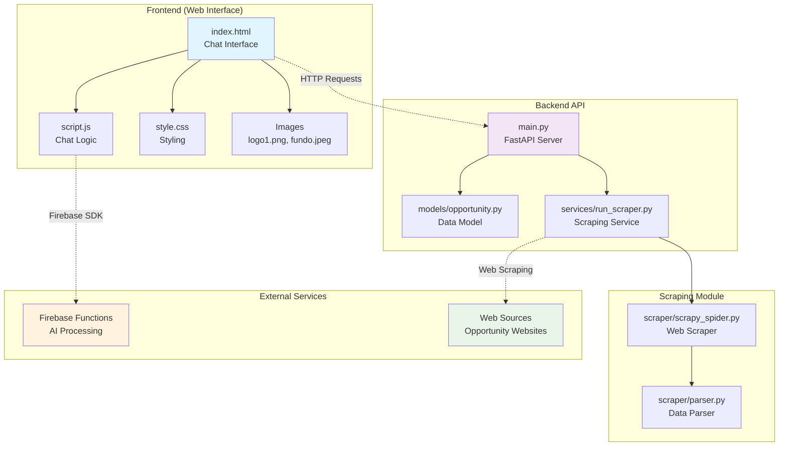

# AIpply Codebase Visualization

## Architecture Overview



## Component Details

### 1. Frontend Components
- **index.html**: Main chat interface with input field and message display
- **script.js**: Handles user interactions, message sending, and Firebase integration
- **style.css**: Modern glassmorphism design with background image
- **Images**: Logo and background assets

### 2. Backend API
- **main.py**: FastAPI server with `/search` endpoint
- **models/opportunity.py**: Pydantic model for opportunity data structure
- **services/run_scraper.py**: Orchestrates web scraping process

### 3. Data Flow
1. User types message in frontend
2. JavaScript sends to Firebase Functions for AI processing
3. AI response triggers backend API call
4. Backend uses Scrapy to scrape opportunity websites
5. Results returned and displayed in chat interface

## Technology Stack
- **Frontend**: HTML5, CSS3, JavaScript (ES6+)
- **Backend**: Python, FastAPI, Pydantic
- **Scraping**: Scrapy, Twisted
- **Cloud**: Firebase Functions
- **Styling**: Glassmorphism design with backdrop blur effects

## File Structure
```
AIpply-API-main/
├── frontend/                 # Web interface
│   ├── index.html           # Main HTML page
│   ├── script.js            # Chat functionality
│   ├── style.css            # Styling
│   └── img/                 # Assets
├── main.py                  # FastAPI server entry point
├── requirements.txt         # Python dependencies
└── startup-opps-api/        # Core API module
    ├── main.py             # (Empty - likely moved to root)
    ├── models/
    │   └── opportunity.py   # Data models
    ├── services/
    │   └── run_scraper.py   # Scraping orchestration
    └── scraper/
        ├── scrapy_spider.py # Web scraper
        └── parser.py        # Data parsing
```

## Key Features
- **Real-time Chat Interface**: Modern chat UI with message timestamps
- **AI-Powered Matching**: Uses Firebase Functions for intelligent opportunity matching
- **Web Scraping**: Automatically gathers startup opportunities from various sources
- **Responsive Design**: Glassmorphism UI with backdrop blur effects
- **RESTful API**: FastAPI-based backend with structured endpoints
